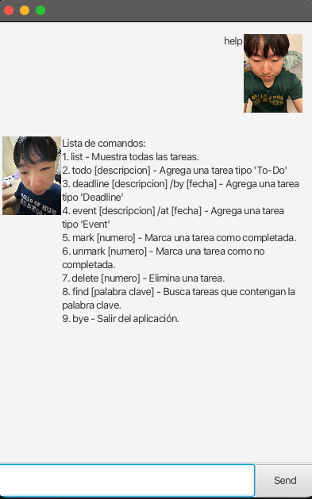

[//]: # (Inspired by https://github.com/Bryce-3D/ip/blob/master/docs/README.md)

# ElChino User Guide

ElChino is an interactive chatbot that helps you manage your tasks. 

ElChino is able to keep track of 3 types of tasks:
1. Todos
2. Deadlines with a due date
3. Events with a start and end date

Users can add, delete, and mark/unmark tasks as done.

# Quick Start
The jar file elchino.jar can be run from any directory. But make sure that elchino.jar is in the same folder as the data folder which contains tasks.txt - to load your saved tasks. If new user, the program will generate the data folder.

Steps to execute elchino.jar:
1. Open a terminal
2. Navigate to the directory containing elchino.jar
3. Run the command `java -jar elchino.jar`

To exit elchino.jar, type `bye` and press Enter. Next, close the dialog box by clicking the X in the upper right corner of the window.

# Commands Overview
This is the list of commands that ElChino can understand:
- `list` - Lists all tasks
- `todo` - Adds a todo task
- `deadline` - Adds a deadline task
- `event` - Adds an event task
- `mark` - Marks a task as done
- `unmark` - Unmarks a task as done
- `delete` - Deletes a task'
- `find` - Finds tasks by keyword
- `bye` - Save and exits the chatbot
- `help` - Displays the list of commands

# Todo Command

Create a new todo

Usage: `todo <description>`

Sample usage:
`todo read book`

# Deadline Command

Create a new deadline

Usage: `deadline <description> /by YYYY-MM-DD HH:MM`

Sample usage:
`deadline return book /by 2021-09-30 23:59`

# Event Command

Create a new event

Usage: `event <description> /at YYYY-MM-DD HH:MM to YYYY-MM-DD HH:MM`

Sample usage:
`event project meeting /at 2021-09-30 14:00 to 2021-09-30 16:00`

# Mark Command

Mark a task as done

Usage: `mark <task number>`

Sample usage:
`mark 1`

# Unmark Command

Unmark a task as done

Usage: `unmark <task number>`

Sample usage:
`unmark 1`

# Delete Command

Delete a task

Usage: `delete <task number>`

Sample usage:
`delete 1`

# Find Command

Find tasks by keyword

Usage: `find <keyword>`

Sample usage:
`find book`

# Bye Command

Save and exits the chatbot

Sample Usage: `bye`

# Help Command

Displays the list of commands

Sample Usage: `help`

